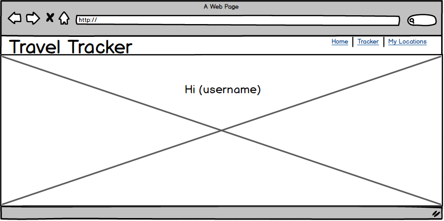
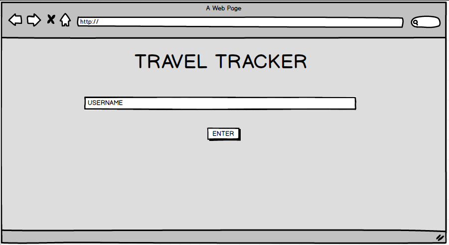
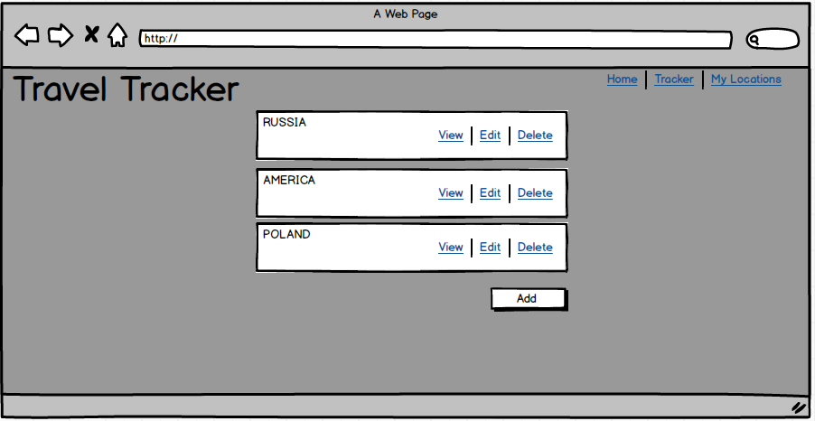
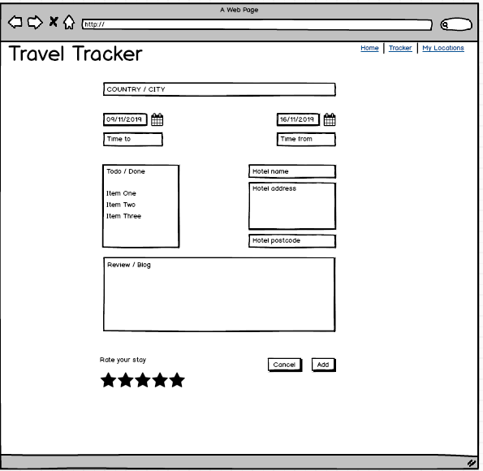
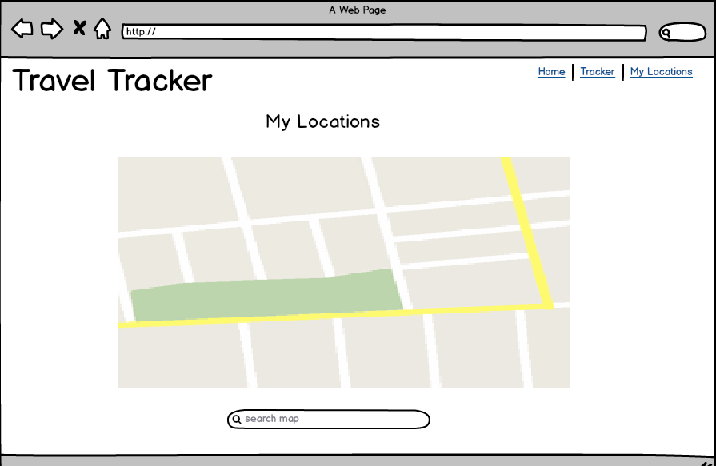

# Travel Tracker

This is my 3rd project for Data Centric Development, I have chosen to use Bootstrap 4 to structure my app.
This is a website to share and review your holiday experiences or you can plan where you are going to go in the future.

The user's can create, read, and share information. When the user logs into the site they can view other user's reviews - just like a trip advisor.

## **UX**

This website was made for people that like to travel and go on holiday. I have created this website so that people can create, read, update, and delete information.

The website can be used as a planner and a website to review countries. The user can add times and dates of flights, and plan key attractions on where they would like to go. You can also go back to your post and review it or you can add a new post for a country you have already been to and review it.

If the user wanted to plan their holiday or post a review, they can register as a new user or login. Then they can click on the add button and fill out the required fields to create a post.

The user will then be able to edit and delete their post but will not be able to on another user's post and all users can read every post.

I have also implemented a map for the user to use. This can track your location, measure distances. I have got some information off the internet and added it onto the map for data vizulisation. The user will be able to plan (if they wanted to) visit the top 10 restaurants, attractions, and countries in the world.

Before I started my project I created wireframes using a software called Balsamiq.

Plan for my homepage.



Plan for my login page.



Plan for my planner page.



Plan for my review page.



Plan for my map page.



## **Features**

### Existing features

On my homepage I have designed a stylish page to engage the user. I have used a Bootstrap 4 carousel with some beautiful photos.
When you scroll down I have said what the website is about and at the bottom I have created a getting started section.

The user after selling it to them can then register, then once a username has been created they will be diverted to the planner board where they can then view and share information.

Also at the bottom of the homepage the user can click on the map and also click on the planner if already a user.

Once the user has clicked on the map, one of the features is that it can track your current location, this can be vital to a user if they are in a foreign country they may get lost or you can use it to plan your journey. All the user will need to do is click on the marker on the left handside and allow the app to track your location.

You can also use the map to measure distances which can come in handy with the location tracker and measure the distances from your current location or anything else that you want to do. You can do all this by clicking on the measuring ruler on the right handside.

Also just under that you can click on the little box and you can then view your map on full screen.

Under that I have created a layer control key so a user can identify the markers on the map and then they can personalise them by unchecking the boxes.

I got the data from Google by searching top 10 restaurants, top 10 countries and top 10 attractions and I put them in a text document using their latitudes and longitudes I was able to add markers.

This will come in handy for a user whilst they are planning a trip or out and about and they want to find where is closest.

### Future additions

At the time of writing this, it is at the end of this project, I have vizualised and planned this as I wanted it to look.

There are some features that I had to find a plan B for that still worked really well and then building further ideas on to that for the future.

My first example is when creating my map - I would like to replace this with Google Maps. I chose to create my map using Folium and I created an algorithum for when a user logs a country to their planner a marker would be added to the map. After I wrote the algoritham I found out that you cannot automatically update the map, so I needed to stop and start the script for updates to take effect, which is not advisable.
My plan B was then to get some information off the internet and just add markers on the map plus add some features to my map.

My website was originally going to be more of a planner where the user would have their own personal logs but due to time restraints I went for plan B and made my site more like a trip advisor site.

In the future I would like my map to be made with Google Maps so a user can automatically add, edit and delete markers. Also I would still like the user review site but also add a personal planner profile page.

## **Technologies used**

To create my app I have used a number of technologies which are the following:

* Balsamiqu
  * To plan my project I used the software Balsamiqu as a recommendation from the Code Institute.

* Virtual Environment
  * To setup my project I have used a virtual environment to install all the dependencies that I need to run my app.

* Python
  * To write my app I have used the Python programming language.

* Flask
  * To create my website I have used the Flask framework.

* MongoDB
  * The database I have chosen to use for the data side of this project is MongoDB to allow the user to use CRUD.

* Environment Variable - Python-dotenv
  * To connect to MongoDB and also store my secret key I have used python-dotenv to create a dot env file and I have hidden this in my gitignore file. For the majority of the project I have stored my MongoDB connection link in my bashrc file to locally store my link but when I have deployed my site using Heroku I have installed python-dotenv and updated my requirements.txt file.

* PyMongo
  * In my project I have installed PyMongo which helps me interact with my MongoDB database.

* ObjectId
  * I have used ObjectId so that I can interact with MongoDB's automatically generated ID key.

* Folium
  * I have installed Folium to create a free map to use with data visualisation.

* Plugins and MeasureControl
  * With Folium I have imported Plugins and MeasureControl for additional features on my map such as to track user's location, measure distances, and giving an option to the user so they can make the map full screen.

* Pandas
  * I have installed Pandas to my app so that I can display data on my Folium map.

* Bootstrap
  * To style and structure my website I have used Bootstrap so I could create grids and easily style and structure my work.

* Bootstrap Carousel
  * One of the things I planned to have on my site was to have an image slider so I used a Bootstrap one. After choosing my images from Google I found they were all different sizes, so I used a free site which was [pixlr.com](https://pixlr.com/editor/) after watching a Youtube video and I made them all the same size and they work effectively.

## **Testing**

Throughout my project I have done various testing on my code such as:

To check connection between MongoDB and my server I opened up what was going to be my main planner page, and I added some basic HTML with my headings from my data.

```HTML

    <p>{{ count.country_name }}<p>
    <p>{{ count.username }}</p>
    <p>{{ count.travel_to_date }}</p>
    <p>{{ count.flight_time_to }}</p>
    <p>{{ count.travel_from_date }}</p>
    <p>{{ count.flight_time_from }}</p>
    <p>{{ count.rating_cat }}</p>

```

To check my dotenv file was working with my secret key and my MongoDB connection, I typed out the following test in the CLI

```bash
>>> import dotenv
>>> from dotenv import load_dotenv
>>> load_dotenv()
True

>>> import os
>>> os.getenv('SECRET_KEY')
# This will show the actual secret key if successful

>>> os.getenv('MONGO_URI')
# This will show the connection link if successful
```

Checking a user is logged in

```python
if 'username' in session:
    print('Welcome ' + session['username'] + ', you are already logged in')
```

Testing the user's rights to use the CRUD feature of my app.

I wanted to make my project have user rights by only being able to use CRUD if they are a member and to do this I started with being able to add a country once the user has filled out the form.

First, to test how to pull the correct data up I created the following:

```python
specific_user = mongo.db.user
if specific_user:
    print('I am logged in')
```

The ```specific_user``` variable will look into my database and check if the user has been added and if so the message will get printed.

So then I added the ```specific_user``` variable to my code as per below.

```python
specific_user = mongo.db.user
the_country = mongo.db.country
the_hotel = mongo.db.hotel
if specific_user:
    the_country.insert_many([
        {
            'country_name':request.form.get('country_name'),
            'travel_to_date':request.form.get('travel_to_date'),
            'travel_from_date':request.form.ge('travel_from_date'),
            'flight_time_to':request.form.get('flight_time_to'),
            'flight_time_from':request.form.get('flight_time_from'),
            'todo_done':request.form.get('todo_done'),
            'blog':request.form.get('blog'),
            'rating_cat':request.form.get('rating_cat')
        }])
```

I then came across another error where I would add a country but then the username would not get automatically printed on the post.

So after a while of testing I came up with the following code to test how to do this:

```python
specific_user = mongo.db.user
if specific_user:
    print(session['username'])
```

This would then print a user whoever is signed in to the app, so for example I signed in as ```Chris09``` so this printed out ```Chris09``` and then I signed in as ```Dave10``` and then this printed out ```Dave10```. So now I know how to automatically assign to a post so I added it to my insert and update code form like so:

```python
specific_country = mongo.db.country.find_one({'_id': ObjectId(country_id)})
specific_user = mongo.db.user
update_country = mongo.db.country
update_hotel = mongo.db.hotel
if specific_user:
    update_country.update({'_id': ObjectId(country_id)},
        {
            'username': session['username'],
            'country_name':request.form.get('country_name'),
            'travel_to_date':request.form.get('travel_to_date'),
            'travel_from_date':request.form.get('travel_from_date'),
            'flight_time_to':request.form.get('flight_time_to'),
            'flight_time_from':request.form.get('flight_time_from'),
            'todo_done':request.form.get('todo_done'),
            'blog':request.form.get('blog'),
            'rating_cat':request.form.get('rating_cat')
        })
    update_hotel.update({'country_name': specific_country['country_name']},
        {
            'country_name':request.form.get('country_name'),
            'hotel_name':request.form.get('hotel_name'),
            'hotel_address':request.form.get('hotel_address'),
            'hotel_postcode':request.form.get('hotel_postcode')
        })
```

I then tested the update route by updating a post and then I found another problem, whichever user edits the post the username name would change to theirs.

To stop a user from editing another user's post I created the following:

```python
specific_user = mongo.db.user.find_one({'username': specific_country['username']})

    if specific_user['username'] != session['username']:
        print('You cannot edit another users post')
```

I would then change ```print``` to ```flash``` and create a flash message which then solved my problem by not letting a user edit another user's post and returning them to the main post page.

I then tried to implement the same for the delete route but I had to slightly change this.

```python
specific_user = mongo.db.user.find_one({'username': specific_country['username']})

if specific_user['username'] == session['username']:
    print('You cannot delete another users post')
```

So if ```specific_user['username']``` is the same as ```session['username']``` this will allow you to delete your own post but if you are not, then an error message will prevent you from deleting another user's post.

I have also had friends, family and my mentor test my site and I have had great and valued feedback from them.

My main fault with my app was the padding for my homepage and data entry form they were the length of the page and the text was too big so after putting them in a Bootstrap container and making the text smaller, the style of my website looks a lot better.

## **Deployment**

To deploy my project I used Heroku and for version control I used Git. I didn't deploy to Heroku until I was close to the end but all thoughout the project I kept updating my Github repository using Git and when I was close to finishing I deployed to Heroku and connected my Github repository and when I made changes to anything I could use Git to update both Github and Heroku at the same time.

To setup and deploy to Heroku you will need to do several things to make it a success.

Your root folder will need a ```requirements.txt``` file - This will specify dependancies needed for your python application.

To install this file you will need to type in your terminal as follows:

```bash
$ pip install -r requirements.txt
```

Also if you install new dependancies you can simply update the ```requirements.txt``` by repeating the line.

You will also need to install a ```Procfile``` - This will also need to be installed in your root folder and this will specify the commands that are executed by the app on startup. You can use a Procfile to declare a variety of process types, including:

* Your app’s web server
* Multiple types of worker processes
* A singleton process, such as a clock
* Tasks to run before a new release is deployed

To install the ```Procfile``` all you are required to do is:

```bash
$ echo web: python app.py > Procfile
```

And then add:

```bash
$ heroku ps:scale web=1
```

By doing these commands you will then be able to use Git to add your work to your repository.

Once you have installed these requirements you will then need to connect your app to Heroku by going onto your settings to your app and you will need to add all the connections inside the config vars.

So connections such as your connection string to your MongoDB database is essential. Whether you have stored your connection in a .bashrc file or in a dotenv file you will need to add the variable name followed by the connection string, and this is the same for your secret key.

You will need to add the key ```PORT``` and that will need setting to the value of ```5000``` and the ```IP``` key will need setting to the value of ```0.0.0.0```.

Once the changes have been saved you should be ready to view your website on the internet. If something is wrong with the deployed app then you will get an error message which will tell you what has gone wrong.

You can also run my code locally because I have used Git to add my whole project to my Github page, you can download my code to your computer and run it on your machine to view and edit the site.

Once you have downloaded my code and you are running it on your IDE you can go to ```app.py``` and scroll down to the very bottom you can then change ```False``` to ```True``` as per the snippet below and then you can change the code and style to your own.

```python
if __name__ == '__main__':
    app.run(host=os.environ.get('IP'),
            port=int(os.environ.get('PORT', 5000)),
            debug=False)
```

## **Credits**

### Content

* The text I have used for my app is all my own words.
* I got the idea and help to create the map and use Folium from a Udemy course I did on the side of this course. The course was by Ardit Sulce and it was to create 10 big web applications.

### Media

* The photos I have used are all from Google.

### Acknowledgements
